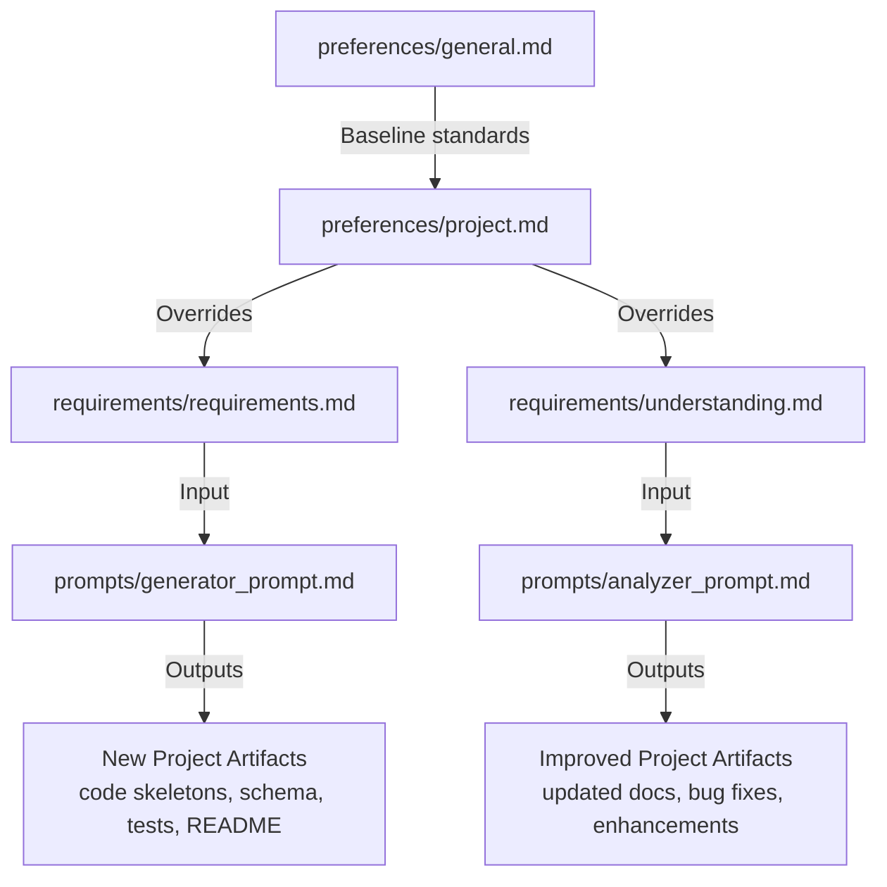

# Project Documentation Ecosystem

This repository provides a **repeatable documentation pattern** for both new and
existing projects. It keeps **global standards**, **project context**, **system
requirements / current state**, and **LLM workflows** clearly separated — but
easy to use together.

---

## Directory Layout

```text
project_docs/
  preferences/
    general.md            # global rules (shared across projects)
    project.md            # project-specific context & overrides
  requirements/
    requirements.md       # future-facing spec (SRS/TRD)
    understanding.md      # current-state snapshot (architecture, features, bugs)
  prompts/
    generator_prompt.md   # create new: code skeletons, schema, tests, README
    analyzer_prompt.md    # improve existing: update docs, fix bugs, enhancements
  docs/
    schema.md             # data dictionary for YAML frontmatter
  README.md
```

---

## Document Types

| File | Purpose | Audience | Inputs | Outputs |
|------|---------|----------|--------|---------|
| `preferences/general.md` | Global standards ("constitution") | Humans + LLMs | Maintained once | Coding/testing/tooling standards |
| `preferences/project.md` | Project-specific context + overrides | Humans + LLMs | General prefs | What makes this project unique |
| `requirements/requirements.md` | System specification (SRS/TRD) | Humans + LLMs | Project context | Functional + non-functional requirements |
| `requirements/understanding.md` | Current state snapshot | Humans + LLMs | Existing code/docs | Architecture, features, bugs, tech debt |
| `prompts/generator_prompt.md` | Instruction set for creating a new project | LLMs | Requirements + general prefs | Code skeletons, DB schema, tests, README, MVP plan |
| `prompts/analyzer_prompt.md` | Instruction set for improving an existing project | LLMs | Understanding + general prefs | Updated docs, bug fixes, plans, improvements |

---

## Workflow



---

## Typical Usage

### New Project

1. Fill `preferences/project.md` (context & overrides).
2. Author `requirements/requirements.md` (spec).
3. Provide `preferences/general.md` + `prompts/generator_prompt.md`
   + `requirements/requirements.md` to the LLM.
4. Receive: architecture summary, code skeleton, DB schema, tests, README, MVP
   plan.

### Existing Project

1. Fill `requirements/understanding.md` (current state).
2. Provide `preferences/general.md` + `prompts/analyzer_prompt.md`
   + `requirements/understanding.md` to the LLM.
3. Receive: updated docs, bug-fix suggestions & regression tests, implementation
   steps, maintainability improvements.

---

## Conventions

+ **Single-source files** use **YAML frontmatter + Markdown**.
+ **General preferences win unless overridden** in `preferences/project.md`.
+ Keep frontmatter terse & machine-friendly; keep prose human-friendly.

---

## Validation Tips (optional)

+ Treat `document_type` as a required enum in each file.
+ Prefer **lists** over comma-separated strings.
+ Keep enums lowercase snake_case for consistency.
+ Use links (paths) for diagrams/ERDs where useful.
+ Only populate `overrides` keys that actually differ from `general.md`.
